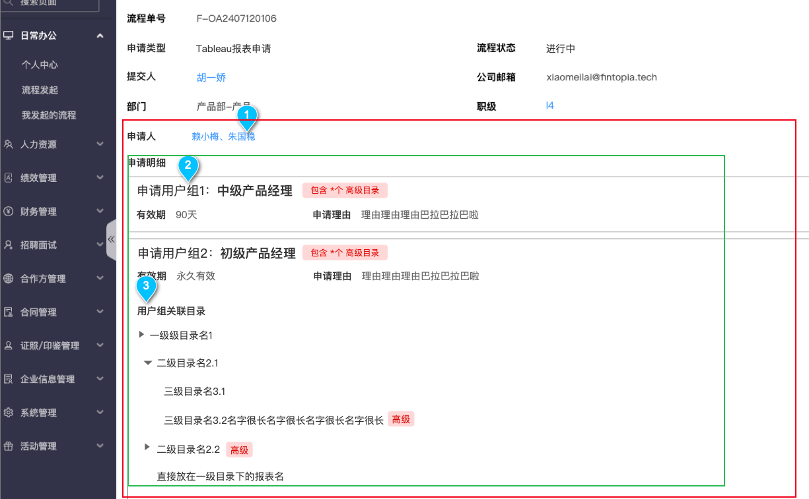
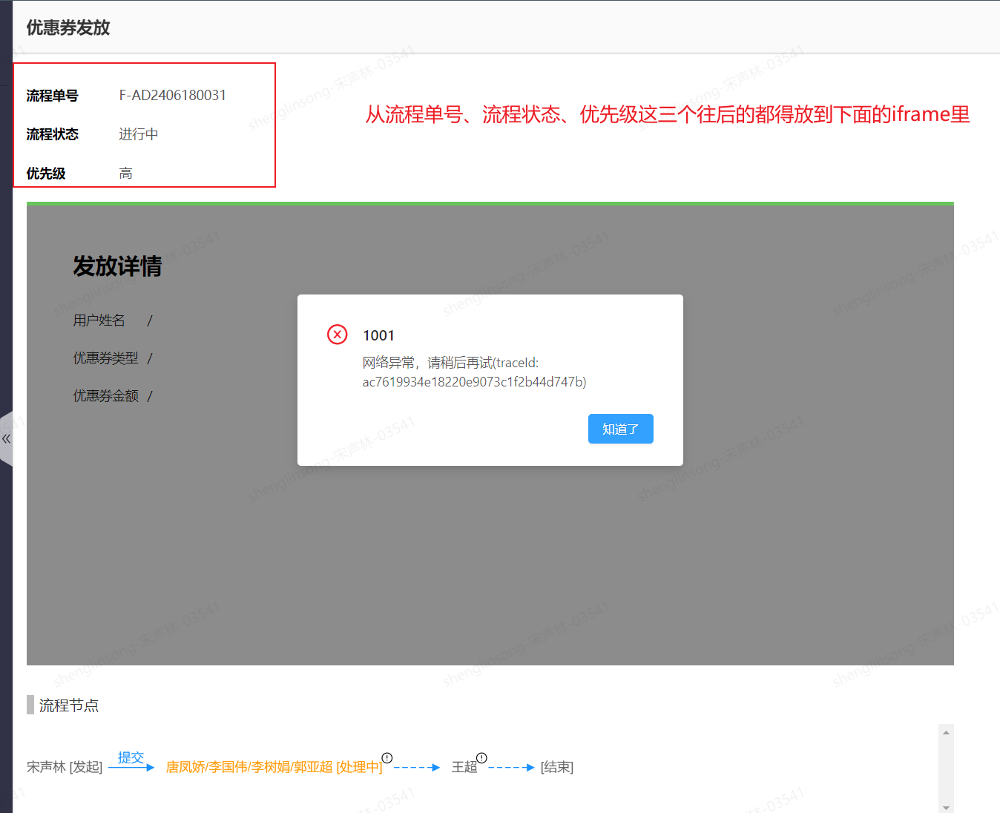
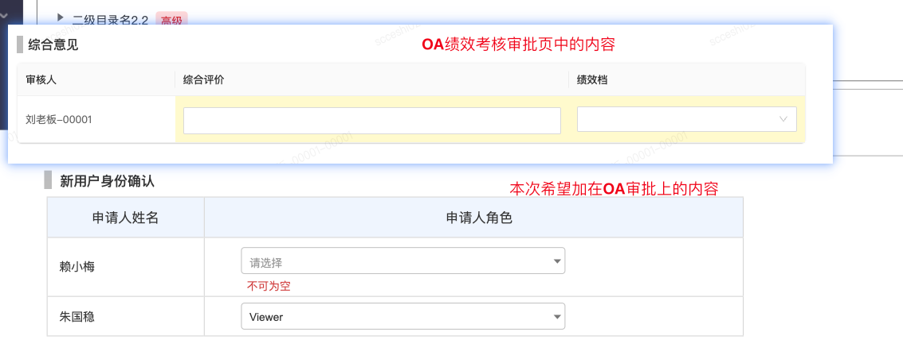
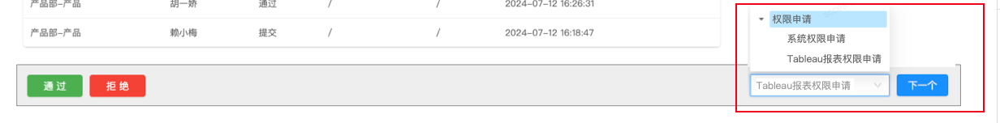
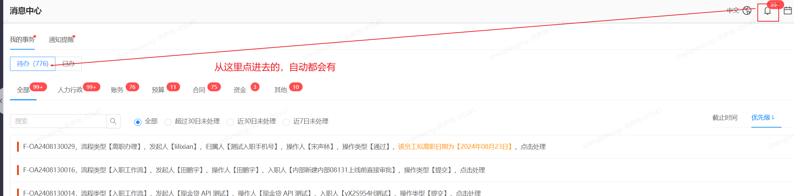

1、是从申请人那个字段开始，就需要权限系统前段开发（红框），还是从申请明细开始（绿框）

答：从流程单号、流程状态、优先级这3个开始往后，都放到权限系统前端开发的iframe页面里，类似下面这种效果：

2、这一部分我看和绩效考核的一个地方很像，能不能直接拿来用呀？还是说也需要权限系统的前端开发？

答：不能拿来用，因为这是流程审批时候，需要用户填写的表单。绩效的表单是针对OA内部流程的，但是OA对外部的流程是不支持填写表单的，我一会儿问下桂远的意见看下是否能支持这块，如果能支持，是OA的前后端来开发，不涉及权限系统的前端。

3、我想给审批人提供个便捷操作（类似：审批完了这个可以自动打开下一个审批单的详情这样）。我看现在OA上右下角有个下拉框，还有个按钮，这块是不是就是提供了便捷审批这个功能的？如果我们的审批也要用，这块还需要OA或者权限系统的前端来开发吗？

答：不需要两边的开发参与。从OA的待办里点进去审批时候，会自动出现这个下一个。
